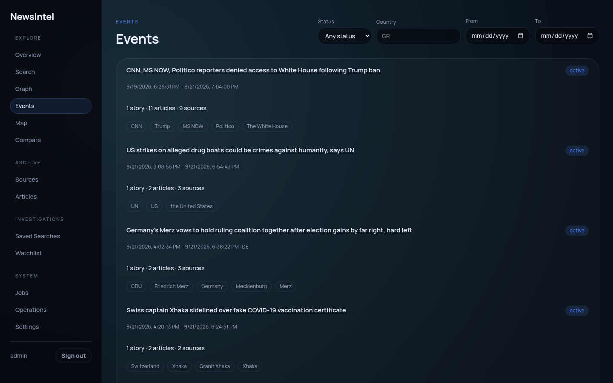
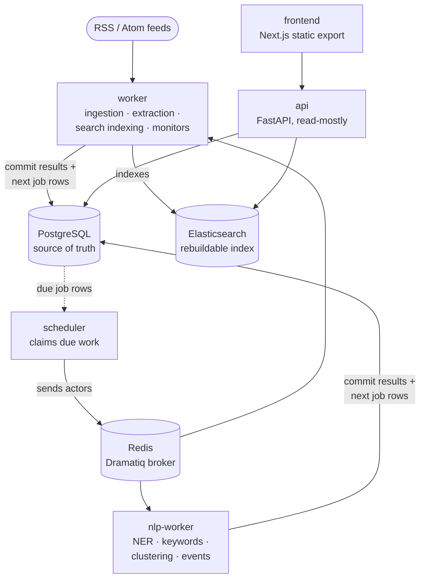
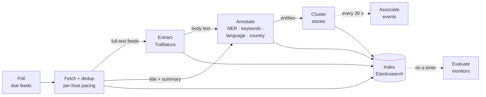
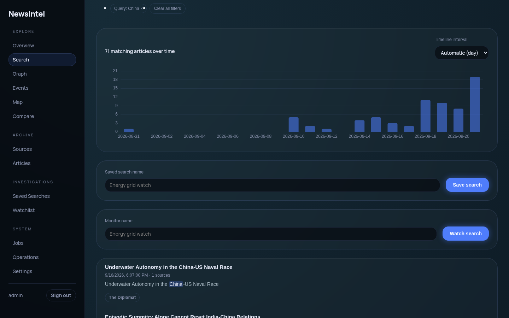
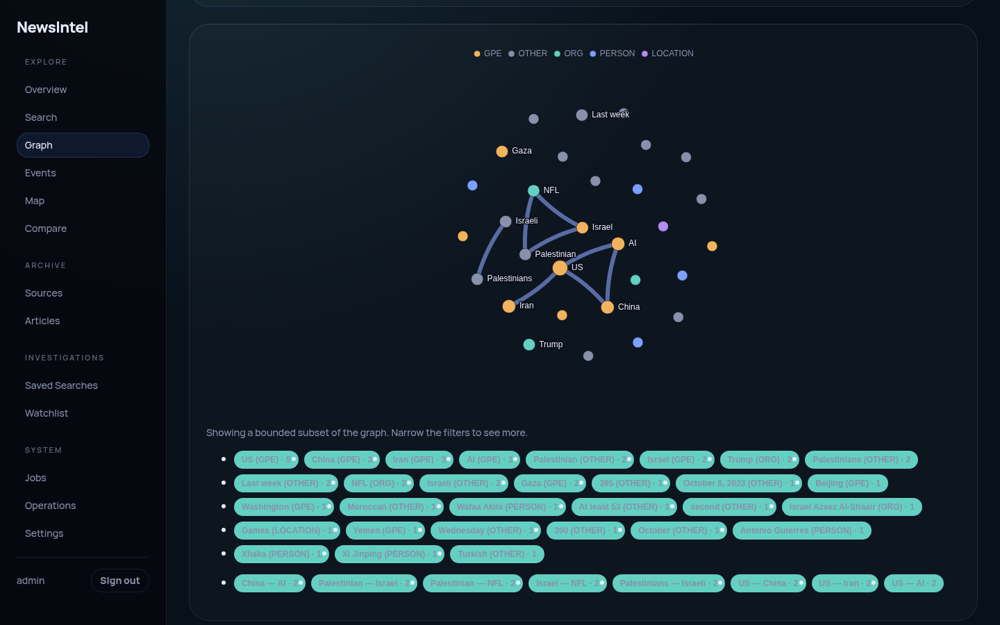
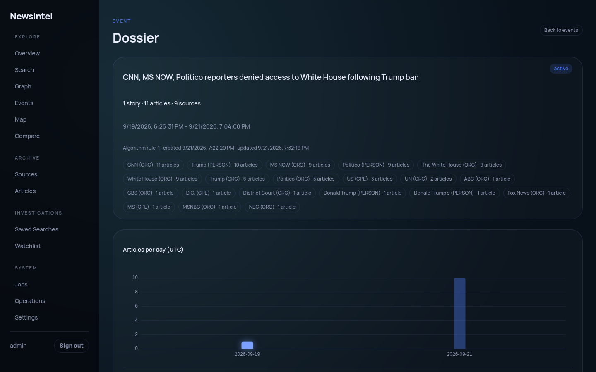
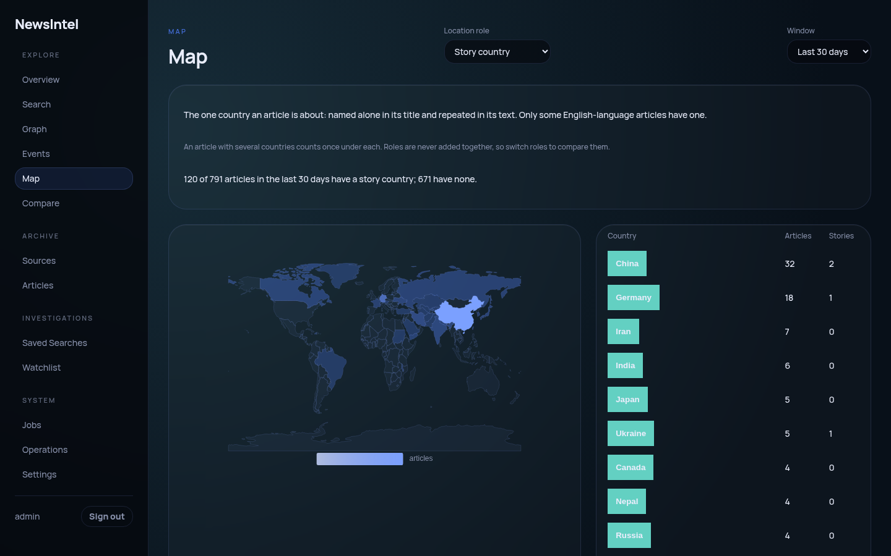

# NewsIntel

**A self-hosted news-intelligence platform that turns a firehose of RSS feeds into a searchable, clustered, investigable archive — no LLM or cloud API required.**



<sub>**Figure 1.** The Events view. Independent reports on the same happening, grouped by a deterministic engine that can tell you why.</sub>

## Abstract

News arrives as a stream of near-duplicates: the same event, rewritten by a dozen outlets, each with its own headline and its own idea of what matters. NewsIntel is a system for reading that stream at archive scale. It continuously collects articles from RSS feeds, deduplicates them, extracts full text, annotates entities and keywords, clusters independent reporting on the same story, associates stories into events, and serves the result through full-text search, an entity relationship graph, a map, and per-source and per-event dossiers. Every derived object — a cluster, an event, a graph edge — remains traceable to the bounded set of articles that produced it. The architecture targets roughly five million archived articles without a rewrite, and the whole system runs self-hosted, auditable, and free of API keys. No large language models were consulted in the making of any conclusion.

## Contents

1. [Design principles](#1-design-principles)
2. [System architecture](#2-system-architecture)
3. [The pipeline, stage by stage](#3-the-pipeline-stage-by-stage)
4. [A tour in figures](#4-a-tour-in-figures)
5. [Tech stack](#5-tech-stack)
6. [Operations](#6-operations)
7. [Development checks](#7-development-checks)
8. [Limitations](#8-limitations)

## 1. Design principles

**P1. PostgreSQL is the single source of truth; Elasticsearch is disposable.** Every write lands in Postgres and is committed before any indexing work exists. The search index can be wiped and rebuilt from scratch at any time, and ingestion keeps working while Elasticsearch is down.

**P2. Derived data stays traceable.** Clusters, events and graph edges are computed from bounded, identifiable article sets. Every edge in the graph is explainable co-occurrence: open it and you get the exact articles and stories behind it, under the same filters as the graph. Every event stores why each cluster joined it.

**P3. Deterministic and versioned over clever and opaque.** NLP annotations (spaCy NER, keywords, language, country) are versioned per processor. Story clustering and event association are rule-based engines behind swappable interfaces, so the same input yields the same output, and a result can be argued with.

**P4. Descriptive, not judgemental.** Source dossiers report health, coverage and timing, each metric shown against its denominator. There is no "quality score": the system describes what a source did, not what it is worth.

**P5. One domain, one module.** The backend is not a god-object API. `feeds`, `articles`, `nlp`, `search`, `clustering`, `analytics`, `entities`, `graph`, `investigations`, `monitors`, `events`, `sources`, `compare`, `geo`, `operations` and `jobs` are separate modules under `backend/app`, each owning its models, service layer and routes.

**P6. Nothing slow happens in a request.** Feed polling, extraction, annotation, clustering and indexing run as background jobs; the API only reads what they have committed.

## 2. System architecture

Five application services and three data services run under Docker Compose, each doing one job.


<sub>**Figure 2.** Service topology. Arrows show who talks to whom; note that no worker talks to another worker.</sub>

## 3. The pipeline, stage by stage

The pipeline has one idea, and it is worth stating plainly: **no stage ever calls the next one.** Instead, each stage writes the next stage's job row *in the same database transaction as its own results*. A single scheduler loop (`backend/app/scheduler.py`) wakes every ten seconds, claims due rows under a time-limited lease, and dispatches the matching Dramatiq actor. If a worker dies mid-job, the lease expires and the work simply becomes visible again. Crashes, retries and Elasticsearch outages therefore cost latency, never data: the only thing that can be lost is work that was never committed, and that work never happened.


<sub>**Figure 3.** Article flow. Solid arrows are job rows written in the producing stage's transaction; dotted arrows are timer-driven. Annotation runs once on the feed item and again when the body text arrives.</sub>

| Stage | Runs on | Writes | Triggers next |
| --- | --- | --- | --- |
| **Poll** | scheduler | feed claim, `feed_fetches` | an `ingest_feed` actor per due feed |
| **Fetch + dedup** | worker | `articles` (deduplicated on normalised URL via `INSERT … ON CONFLICT DO NOTHING`), `feed_articles` | extraction job (full-text feeds), NLP jobs and an index delivery when the input is new or changed |
| **Extract** | worker | `article_contents` with a content hash, so unchanged pages are not reprocessed | NLP jobs and an index delivery |
| **Annotate** | nlp-worker | entities, keywords, language and country annotations, one versioned run per processor | a clustering job (entities processor only); an index delivery (every processor) |
| **Cluster** | nlp-worker | `story_clusters`, members | index deliveries for every article whose cluster changed |
| **Associate events** | nlp-worker, every 30 s plus a 5-minute sweep | `events`, `event_clusters` with join scores and signals, a record of each run | — |
| **Index** | worker | per-article search state and deliveries per index target | — |
| **Monitors** | worker, on each monitor's own interval | cursors and unseen counts on `monitors` | — |

Two details make the index trustworthy. Each article carries a *revision* bumped on every change, and a delivery only lands if its revision is still current, so a slow worker cannot overwrite a newer document with an older one. And indices are versioned behind an alias: a reindex builds a new index alongside the live one and swaps the alias, with no downtime.

## 4. A tour in figures


<sub>**Figure 4.** Search. Full-text queries with field filters, a matching-articles timeline, and highlighted hits. Any search can be saved as a running case file or turned into a monitor that the scheduler re-evaluates in the background. The **Watchlist** then shows each monitor's new articles and stories, with a deterministic "What changed" summary (new sources, entities and stories, and stories that gained sources) linked to the evidence.</sub>

**Search is the investigation hub.** The query and filters live in the URL, and every view reads that same state: bounded facets beside the results (10 values per group, 25 at most), the Graph and the Map. (Overview stays on its own recent-window scope; the API's `scope=investigation` mode exists but the only caller is Map.) An article's detail page adds **Related coverage**: other articles with similar wording from outside the article's own story, found by Elasticsearch `more_like_this`. Similar wording is not a confirmed connection, and the panel says so.


<sub>**Figure 5.** The relationship graph: who and what keeps showing up together. Deliberately bounded — "narrow the filters to see more" is a feature, not an apology. Each edge opens the articles and stories behind it, and each entity has a dossier with its articles, stories and closest neighbours.</sub>


<sub>**Figure 6.** An event dossier: a UTC-day timeline, the member stories with their join scores and signals, the articles, and every entity involved. Events are grouped by time, shared entities, headline overlap and story country, and served by the read-only `/api/v1/events` API.</sub>


<sub>**Figure 7.** The map, by *story country*: the one country an article is about. Location roles are never summed together, and the page tells you how many articles have no country at all, because a choropleth that hides its denominator is just a very confident guess. Opened from Search, the map covers the whole investigation from Elasticsearch, and its story and source counts are estimates, shown as `≈N (estimated)`. Opened on its own, it keeps the recent-window PostgreSQL mode, with exact counts, which works while Elasticsearch is down.</sub>

The remaining routes follow the same design language:
- **Sources**: per-feed dossiers with health, fetch history and coverage, and where the source sits in story timing (first to publish in N of M shared stories, or the median minutes behind the first article).
- **Compare**: sources side by side.
- **Clusters**, **Articles** and **Jobs**.
- **Operations**: dependency health, pipeline backlogs, feed health and storage.
- **Settings**.

## 5. Tech stack

| Layer | Technology |
| --- | --- |
| Backend | Python, FastAPI, SQLAlchemy 2, Alembic, Pydantic, `uv` |
| Background jobs | Dramatiq, Redis, PostgreSQL job tables with leases |
| Canonical storage | PostgreSQL |
| Search | Elasticsearch (versioned indices behind an alias, zero-downtime reindexing): full text, facets, investigation analytics and map, related coverage |
| NLP | spaCy NER, pluggable/versioned processors |
| Extraction | Trafilatura, behind a replaceable extractor interface |
| Frontend | Next.js (App Router, static export), React, TypeScript, TanStack Query, Apache ECharts |
| Deployment | Docker Compose |

## 6. Operations

**First run.** Elasticsearch starts empty; run `docker compose --env-file .env -f docker/compose.yaml run --rm api python -m app.cli rebuild-search` once before Search or the Overview analytics panels have anything to show. It prints `status=completed` once the alias points at the new index; if articles changed during the scan it prints `status=catching_up`, so run `python -m app.cli resume-search-rebuild <rebuild_id>` until it completes (`search-index-status` lists rebuilds).

**What needs Elasticsearch.** Search, facets, the Overview analytics panels, the Graph, the Watchlist's results, "What changed" and evaluation, the investigation Map and Related coverage read the index. While it is down they return an error or say they are unavailable, and ingestion, processing and the recent-window Map keep working. A view that needs a newer index than the current one asks for an upgrade; run `rebuild-search` (then `resume-search-rebuild <rebuild_id>` if it reports `catching_up`), which builds the new index beside the live one and moves the alias once it has caught up. The previous index is kept for rollback.

**Estimated counts.** Three numbers come from Elasticsearch's cardinality estimate (precision 3000). Two are labelled: the distinct stories behind a Graph edge ("about N stories (estimated)"), and the story and source counts of the investigation Map (`≈N` in the table, "estimated" to a screen reader). The Watchlist's "N new stories" badge is not marked; it is a notification count and near-exact below 3000 distinct stories. Every other count is exact for the indexed snapshot.

The Operations page (`/operations/`) shows dependency health, pipeline backlogs, feed health and storage. Two things it does not show:

- **Article file size.** Retained article HTML lives on the worker's `article-data` volume, which only the worker mounts. Measure it from the host: `docker compose --env-file .env -f docker/compose.yaml exec worker du -sh /var/lib/newsintel/articles`.
- **History retention.** Every hour, the scheduler deletes succeeded job rows older than 30 days that a newer row replaces, and sessions that expired or were revoked more than 30 days ago. Failed rows are kept for diagnosis.

### Backup and restore

PostgreSQL holds everything that matters (P1). Elasticsearch is rebuilt from it, so it needs no backup. Retained article HTML, on the worker's `article-data` volume, is optional. The full Docker test gate rehearses the dump and restore (`infra/test-restore.sh`).

Back up:

```sh
alias dc='docker compose --env-file .env -f docker/compose.yaml'
dc exec -T postgres pg_dump -U newsintel -Fc newsintel > newsintel-$(date +%F).dump
dc run --rm --no-deps -T worker tar czf - -C /var/lib/newsintel articles > articles-$(date +%F).tgz  # optional
```

Restore:

```sh
dc stop api worker nlp-worker scheduler
dc exec -T postgres pg_restore -U newsintel -d newsintel --clean --if-exists --no-owner --exit-on-error < newsintel-DATE.dump
dc run --rm --no-deps -T worker tar xzf - -C /var/lib/newsintel < articles-DATE.tgz  # if backed up
dc run --rm api alembic upgrade head    # a dump from an older release needs the newer migrations
dc up -d
dc run --rm api python -m app.cli rebuild-search   # the index no longer matches the restored rows; resume-search-rebuild <id> if catching_up
```

## 7. Development checks

The system is typed and tested end to end. Development and validation require Docker, Docker Compose, Git, and ordinary POSIX shell utilities; Python, Node, browsers, databases, and test tools run in containers.

- **Backend:** SQLAlchemy 2 and Pydantic, checked with `ruff` and `mypy`.
- **Frontend:** TypeScript, using API types generated from the checked-in OpenAPI spec.
- **Full gate:** `./infra/test-docker.sh` builds dedicated test images, runs backend and frontend checks, rejects skipped tests and stale generated contracts, rehearses backup/restore, and runs every browser workflow against disposable Compose stacks.

Run the maintained whole-repository gate from the repository root:

```sh
./infra/test-docker.sh
```

This is the only gate that counts as a full regression run: it is the sole binding check before merging (see below), and the sole source of the timing/memory baselines this section describes.

Faster local loops trade coverage for speed and never replace the full gate:

- `./infra/test-quick.sh` — unit-only backend tests (`classify.py --paths unit`) plus ruff, mypy, the OpenAPI/TypeScript contract checks, and frontend unit/typecheck. No service containers start (`--no-deps` throughout, `network_mode: none`); it does not run integration tests, migrations, the restore rehearsal, `npm run build`, or any browser group.
- `./infra/test-integration.sh <pytest-node-id>...` — runs exactly the integration modules named on the command line, starting only the services `backend/tests/classification.toml` says that selection actually needs (never Postgres/Redis/Elasticsearch/the fixture server unconditionally). Resolves the selection before starting anything: an unknown or empty selection, or a unit-kind module (unit tests belong in `test-quick.sh`), fails before any container starts.

Browser workflows can be run separately with `./infra/test-e2e.sh <search|investigations|monitors|graph>`. Each command uses a fresh database and isolated Compose network. Containers and volumes are always removed. Passing `--reuse-images <manifest>` (the form `test-docker.sh` itself uses internally, dispatching each of the four groups against the images it just built) skips that group's own image build and trusts the images recorded in `<manifest>` — a `image-manifest.env` file written by a `test-docker.sh` run, naming each image tag/ID plus the git revision and a working-tree hash it was built from. Before using them, `test-e2e.sh` re-checks all of it: the manifest's revision must equal current `HEAD`, its tree hash must still match the working tree (`git status --porcelain` + `git diff HEAD`, hashed — catches even uncommitted changes), and each named image ID must still match what `docker image inspect` reports. Any mismatch — wrong revision, a tree that changed since the images were built, or an image that's missing or stale — exits 2 before starting a single container, naming exactly which check failed.

Every script's diagnostics (Compose logs on failure, pytest output, Playwright traces and screenshots, and the reports below) land under `docs/archive/testing/<date>-<label>-<n>/` by default (gitignored; `<label>` is `test`/`quick`/`integration`/`e2e-<group>`/`inventory`), or under `NEWSINTEL_TEST_ARTIFACTS` / `NEWSINTEL_E2E_ARTIFACTS` if set (must be an absolute path — it's bind-mounted into containers). Every run, pass or fail, writes:
- `environment.txt` — git revision/dirty flag, Docker/Compose versions, `nproc`, total memory, and a cache-state label.
- `timings.tsv`/`timings.txt` — per-stage start time, elapsed seconds and exit status, plus a slowest-first summary with a `TOTAL`. A stage's status is only known once the *next* stage starts (or the run ends), so an interrupted run's last stage is correctly attributed the interrupting signal's exit status (e.g. 130 for `kill -INT`).
- `memory.tsv`/`memory.txt` — `docker stats --no-stream` sampled every `NEWSINTEL_MEM_SAMPLE_SECONDS` (default 10s) against the run's own Compose project, normalized to bytes, with per-container and aggregate sampled peaks. Documented limitations: the sampling interval can miss short spikes between polls, values are per-container cgroup memory (not host or BuildKit peak — `buildkitd` runs outside the Compose project label, so build memory is invisible to this sampler).
- `test-docker.sh` additionally writes `images.tsv` (every built image's ID) and `image-manifest.env` (the `--reuse-images` manifest described above).

`infra/test-inventory.sh` (read-only, `--no-deps`, starts nothing but the backend/frontend test images) writes a plain listing of what each gate actually selects — `inventory/backend-full.txt`/`backend-quick.txt` (pytest `--collect-only`), `inventory/frontend-tests.txt` (`npx vitest list`), and per-group `inventory/e2e-<group>-{specs,invocations}.txt` — useful for confirming a change to the test scripts didn't silently add, drop, or rescope a test.

There is no automated pre-merge gate: pushes and pull requests have no automatic test run, nightly regression run, or status check. Run `./infra/test-docker.sh` before merging. The older phase acceptance scripts remain historical records; `./infra/test-docker.sh` is the maintained full-suite entry point.

## 8. Limitations

In the tradition of papers that are honest about their methods:

- **No summarisation or "insight" generation.** NewsIntel groups, counts and links; it does not paraphrase. This is a choice: every output can be traced to its articles (P2), which a generated summary cannot promise.
- **Entity quality is spaCy's quality.** NER mislabels things (the graph in Figure 5 has met a "Last week" it believes is an entity). Annotations are versioned, so a better model can be rerun over the archive without losing the old results.
- **Story country is conservative.** It is only assigned when a country is named alone in the title and repeated in the text, and mainly for English-language articles, so most articles have none. The map says so rather than guessing.
- **Rule-based clustering and events.** They are deterministic and explainable, but they miss paraphrases that share neither entities nor headline terms.
- **Related coverage is wording, not meaning.** It needs at least five shared terms, so a paraphrase in different words is missed, and a short or text-poor article gets no related coverage rather than a guess.
- **Scale is designed, not unlimited.** The target is on the order of five million articles on a single Compose host. Beyond that, the ceilings are named in the code as they are met.

## License

[MIT](LICENSE)
