# NewsIntel

**A self-hosted news-intelligence platform that turns a firehose of RSS feeds into a searchable, clustered, investigable archive — no LLM or cloud API required.**


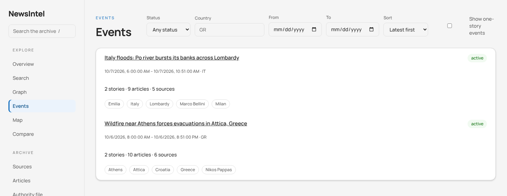
<sub>**Figure 1.** The Events view. Independent reports on the same happening, grouped by a deterministic engine that can tell you why. The screenshots in this README come from a small sample archive of fictional outlets.</sub>

## Abstract

News arrives as a stream of near-duplicates: the same event, rewritten by a dozen outlets, each with its own headline and its own idea of what matters. NewsIntel is a system for reading that stream at archive scale. It continuously collects articles from RSS feeds, deduplicates them, extracts full text, annotates entities and keywords, clusters independent reporting on the same story, associates stories into events, and serves the result through full-text search, an entity relationship graph, a map, and per-source and per-event dossiers. An authority file, in the tradition of library cataloguing, gives every person, place and organisation one established name, gathers its other spellings under it, and records the links you state between entities. Every derived object — a cluster, an event, a graph edge — remains traceable to the bounded set of articles that produced it. The architecture targets roughly five million archived articles without a rewrite, and the whole system runs self-hosted, auditable, and free of API keys. No large language models were consulted in the making of any conclusion.

## Quickstart

You need Docker with Compose. From the repository root:

```sh
cp .env.example .env
# Edit .env: set POSTGRES_PASSWORD, NEWSINTEL_SECRET_KEY (32+ characters),
# and NEWSINTEL_ADMIN_USERNAME / NEWSINTEL_ADMIN_PASSWORD (12+ characters) for your first account.
alias dc='docker compose --env-file .env -f docker/compose.yaml'
dc up -d --build                                  # the setup service applies migrations and creates that account
dc run --rm api python -m app.cli rebuild-search  # build the search index once
```

Open http://127.0.0.1:8080 (or your `NEWSINTEL_PORT`), sign in, and add a feed under **Sources**. The Overview page keeps a short checklist until the archive has sources, articles and a search index.

- **Entities are off by default.** The default image leaves out spaCy, so the entity charts, the graph and the entity dossiers stay empty, and story clustering and event association work without their entity signal. Add `-f docker/compose.ner.yaml` to every `dc` command (and rebuild) to turn named-entity recognition on.
- **More accounts**, or a first account without the `.env` variables: `dc run --rm api python -m app.cli create-user <name>` asks for a password.

## Contents

1. [Design principles](#1-design-principles)
2. [System architecture](#2-system-architecture)
3. [The pipeline, stage by stage](#3-the-pipeline-stage-by-stage)
4. [A tour in figures](#4-a-tour-in-figures)
5. [Tech stack](#5-tech-stack)
6. [Operations](#6-operations)
7. [Development checks](#7-development-checks)
8. [Limitations](#8-limitations)

## 1. Design principles

**P1. PostgreSQL is the single source of truth; Elasticsearch is disposable.** Every write lands in Postgres and is committed before any indexing work exists. The search index can be wiped and rebuilt from scratch at any time, and ingestion keeps working while Elasticsearch is down.

**P2. Derived data stays traceable.** Clusters, events and graph edges are computed from bounded, identifiable article sets. Every edge in the graph is explainable co-occurrence: open it and you get the exact articles and stories behind it, under the same filters as the graph. Every event stores why each cluster joined it.

**P3. Deterministic and versioned over clever and opaque.** NLP annotations (spaCy NER, keywords, language, country) are versioned per processor. Story clustering and event association are rule-based engines behind swappable interfaces, so the same input yields the same output, and a result can be argued with.

**P4. Descriptive, not judgemental.** Source dossiers report health, coverage and timing, each metric shown against its denominator. There is no "quality score": the system describes what a source did, not what it is worth.

**P5. One domain, one module.** The backend is not a god-object API. `feeds`, `articles`, `nlp`, `search`, `clustering`, `analytics`, `entities`, `graph`, `investigations`, `monitors`, `events`, `sources`, `compare`, `geo`, `operations`, `auth` and `jobs` are separate modules under `backend/app`, each owning its models, service layer and routes.

**P6. Nothing slow happens in a request.** Feed polling, extraction, annotation, clustering and indexing run as background jobs; the API reads what they have committed. When you change the authority file, the API records the decision at once, and the scheduler moves the affected articles over in batches.

**P7. A decision about a name can be undone.** Merging two spellings never deletes either: the other name stays a variant that can be split back out, every mention keeps the spelling it was found under, and each change is written to the entity's history. Names you mark as different are not suggested again, and links between entities are stated by you, never inferred, so they never count as co-occurrence.

## 2. System architecture

Five application services and three data services run under Docker Compose, each doing one job. A sixth, one-shot `setup` service applies the migrations and creates the first account before the others start; it is left out of the figure.

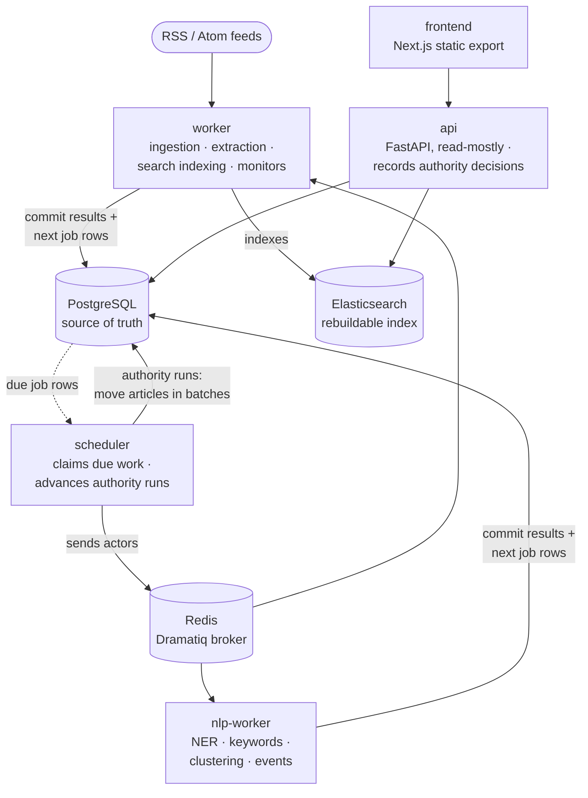
```mermaid
flowchart TB
    feeds(["RSS / Atom feeds"])
    scheduler["scheduler<br/>claims due work ·<br/>advances authority runs"]
    redis[("Redis<br/>Dramatiq broker")]
    worker["worker<br/>ingestion · extraction ·<br/>search indexing · monitors"]
    nlp["nlp-worker<br/>NER · keywords ·<br/>clustering · events"]
    pg[("PostgreSQL<br/>source of truth")]
    es[("Elasticsearch<br/>rebuildable index")]
    api["api<br/>FastAPI, read-mostly ·<br/>records authority decisions"]
    frontend["frontend<br/>Next.js static export"]

    scheduler -- "sends actors" --> redis
    redis --> worker & nlp
    feeds --> worker
    worker & nlp -- "commit results +<br/>next job rows" --> pg
    worker -- "indexes" --> es
    pg -. "due job rows" .-> scheduler
    scheduler -- "authority runs:<br/>move articles in batches" --> pg
    frontend --> api
    api --> pg & es
```
<sub>**Figure 2.** Service topology. Arrows show who talks to whom; note that no worker talks to another worker. The scheduler also carries out authority runs itself: a merge or split moves a batch of articles each cycle and asks for them to be reindexed.</sub>

## 3. The pipeline, stage by stage

The pipeline has one idea, and it is worth stating plainly: **no stage ever calls the next one.** Instead, each stage writes the next stage's job row *in the same database transaction as its own results*. A single scheduler loop (`backend/app/scheduler.py`) wakes every ten seconds, claims due rows under a time-limited lease, and dispatches the matching Dramatiq actor. If a worker dies mid-job, the lease expires and the work simply becomes visible again. Crashes, retries and Elasticsearch outages therefore cost latency, never data: the only thing that can be lost is work that was never committed, and that work never happened.

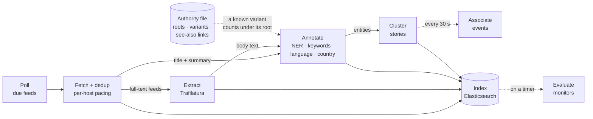
```mermaid
flowchart LR
    poll["Poll<br/>due feeds"] --> fetch["Fetch + dedup<br/>per-host pacing"]
    fetch -- "full-text feeds" --> extract["Extract<br/>Trafilatura"]
    fetch -- "title + summary" --> nlp["Annotate<br/>NER · keywords ·<br/>language · country"]
    extract -- "body text" --> nlp
    authority[("Authority file<br/>roots · variants ·<br/>see-also links")]
    authority -. "a known variant<br/>counts under its root" .-> nlp
    nlp -- "entities" --> cluster["Cluster<br/>stories"]
    cluster -. "every 30 s" .-> events["Associate<br/>events"]

    fetch --> index[("Index<br/>Elasticsearch")]
    extract --> index
    nlp --> index
    cluster --> index

    index -. "on a timer" .-> monitors["Evaluate<br/>monitors"]
```
<sub>**Figure 3.** Article flow. Solid arrows are job rows written in the producing stage's transaction; dotted arrows are timer-driven, except the one from the authority file, which annotation reads. Annotation runs once on the feed item and again when the body text arrives.</sub>

| Stage | Runs on | Writes | Triggers next |
| --- | --- | --- | --- |
| **Poll** | scheduler | feed claim, `feed_fetches` | an `ingest_feed` actor per due feed |
| **Fetch + dedup** | worker | `articles` (deduplicated on normalised URL via `INSERT … ON CONFLICT DO NOTHING`), `feed_articles` | extraction job (full-text feeds), NLP jobs and an index delivery when the input is new or changed |
| **Extract** | worker | `article_contents` with a content hash, so unchanged pages are not reprocessed | NLP jobs and an index delivery |
| **Annotate** | nlp-worker | entities, keywords, language and country annotations, one versioned run per processor | a clustering job (entities processor only); an index delivery (every processor) |
| **Cluster** | nlp-worker | `story_clusters`, members, each article's opening-wording terms | index deliveries for every article whose cluster changed |
| **Associate events** | nlp-worker, every 30 s plus a 5-minute sweep | `events`, `event_clusters` with join scores and signals, a record of each run | — |
| **Index** | worker | per-article search state and deliveries per index target | — |
| **Monitors** | worker, on each monitor's own interval | cursors and unseen counts on `monitors` | — |
| **Authority runs** | scheduler, one batch per cycle | after a merge or split, each article's entity rows under the root or the variant; a rename reindexes the root's articles | an index delivery per article; the events those articles belong to are recomputed |

Two details make the index trustworthy. Each article carries a *revision* bumped on every change, and a delivery only lands if its revision is still current, so a slow worker cannot overwrite a newer document with an older one. And indices are versioned behind an alias: a reindex builds a new index alongside the live one and swaps the alias, with no downtime.

## 4. A tour in figures

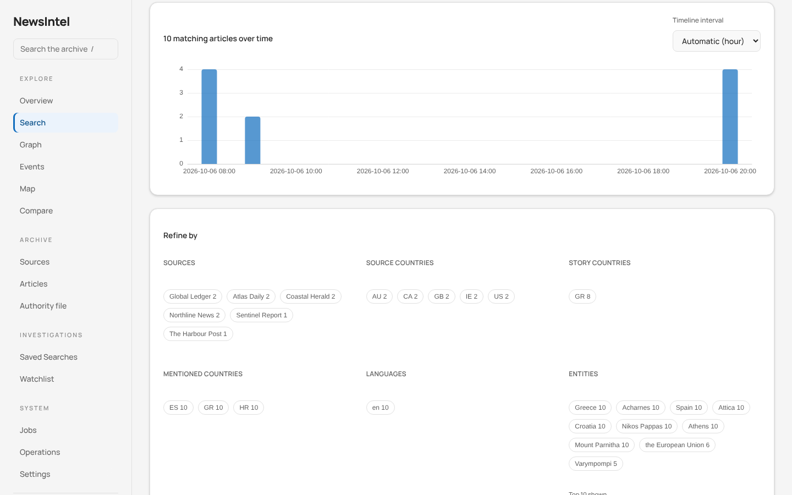
<sub>**Figure 4.** Search. Full-text queries with field filters, a matching-articles timeline, bounded facets, and highlighted hits below them. Any search can be saved as a running case file or turned into a monitor that the scheduler re-evaluates in the background. The **Watchlist** then shows each monitor's new articles and stories, with a deterministic "What changed" summary (new sources, entities and stories, and stories that gained sources) linked to the evidence.</sub>

**Search is the investigation hub.** The query and filters live in the URL, and every view reads that same state: bounded facets beside the results (10 values per group, 25 at most), the Graph and the Map. (Overview stays on its own recent-window scope; the API's `scope=investigation` mode exists but the only caller is Map.) An article's detail page adds **Related coverage**: other articles with similar wording from outside the article's own story, found by Elasticsearch `more_like_this`. Similar wording is not a confirmed connection, and the panel says so.

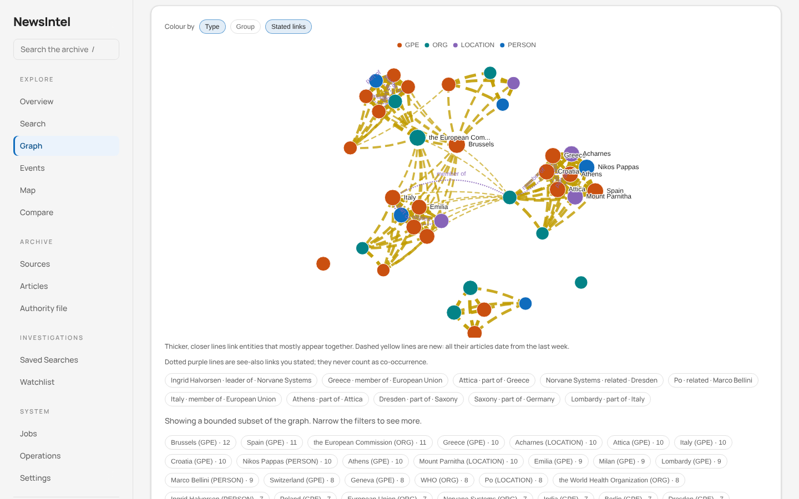
<sub>**Figure 5.** The relationship graph: who and what keeps showing up together. Deliberately bounded — "narrow the filters to see more" is a feature, not an apology. Each edge opens the articles and stories behind it, and each entity has a dossier with its articles, stories and closest neighbours. **Stated links** draws the see-also links you recorded (Attica is part of Greece, Ingrid Halvorsen leads Norvane Systems) as dotted purple lines and lists them; they never count as co-occurrence. Dashed yellow lines are new: all their articles date from the last week.</sub>

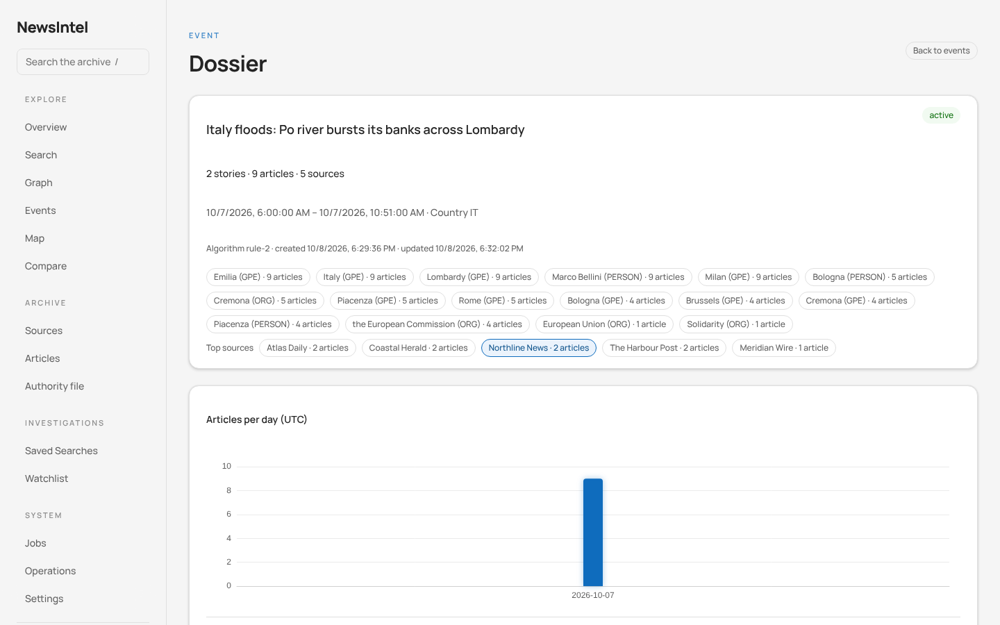
<sub>**Figure 6.** An event dossier: a UTC-day timeline, the member stories with their join scores and signals, the articles, and every entity involved. Events are grouped by time, shared entities, headline overlap and story country, and served by the read-only `/api/v1/events` API.</sub>

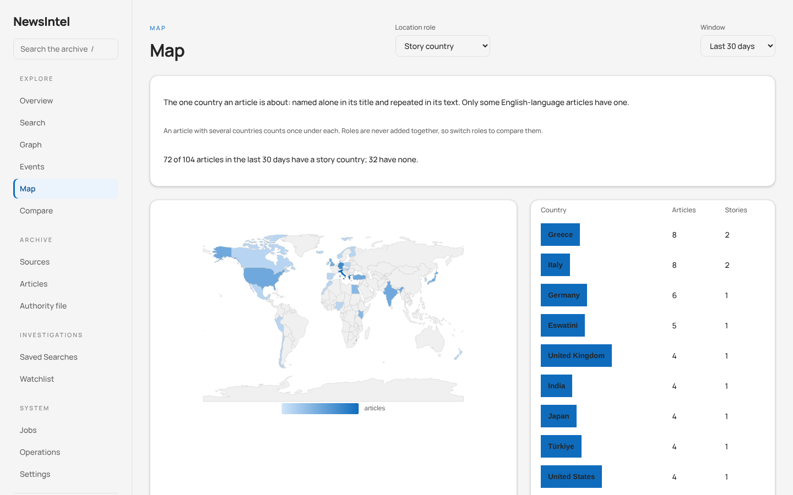
<sub>**Figure 7.** The map, by *story country*: the one country an article is about. Location roles are never summed together, and the page tells you how many articles have no country at all, because a choropleth that hides its denominator is just a very confident guess. Opened from Search, the map covers the whole investigation from Elasticsearch, and its story and source counts are estimates, shown as `≈N (estimated)`. Opened on its own, it keeps the recent-window PostgreSQL mode, with exact counts, which works while Elasticsearch is down.</sub>

### The authority file

NER finds names, not entities: "WHO" and "the World Health Organization", or "A. Okafor" and "Amara Okafor", arrive as different entities, and a spelling that splits an entity in two also splits its counts, its graph edges and its search results. The authority file is how you join them, following library cataloguing practice: one established name per entity (the *root*), the other spellings as its *variants*, and see-also links between entities that are related but not the same.

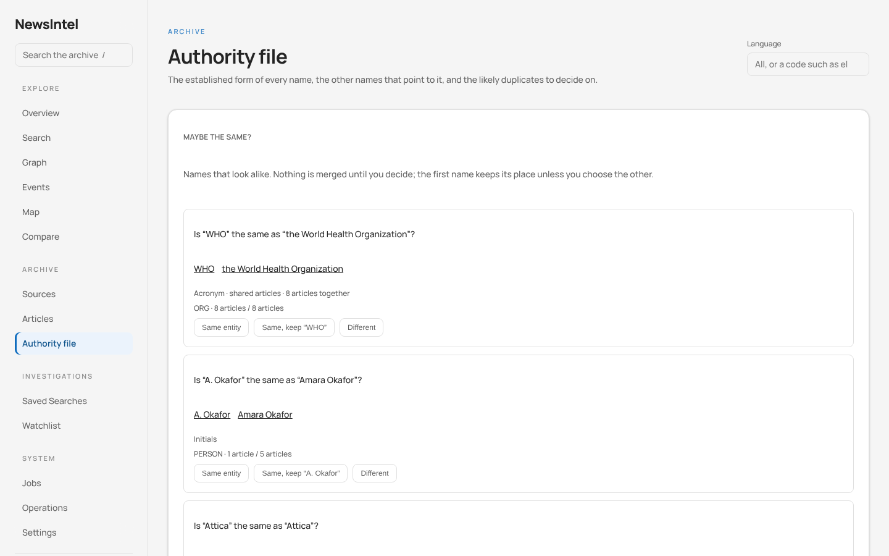
<sub>**Figure 8.** The **Authority file** page. "Maybe the same?" lists likely duplicates (an acronym, initials, a surname on its own, a similar spelling), with the articles both names share; nothing merges until you answer. Further down are the authority file itself, searchable by any of an entity's names and narrowed by language or to provisional names, and the recent changes.</sub>

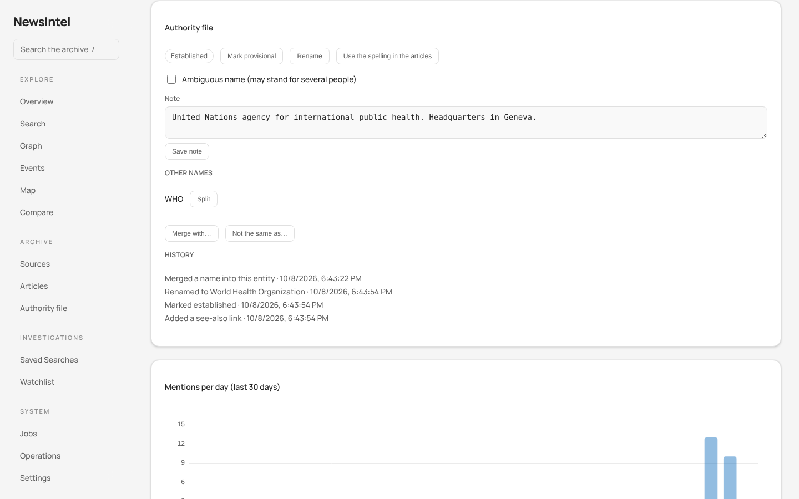
<sub>**Figure 9.** The authority controls on an entity's dossier: mark the name established or provisional, rename it, mark it ambiguous (a name that may stand for several people), keep a note, merge it with another name or record that two names are different. Every merged name can be split back out, and the history lists every change.</sub>

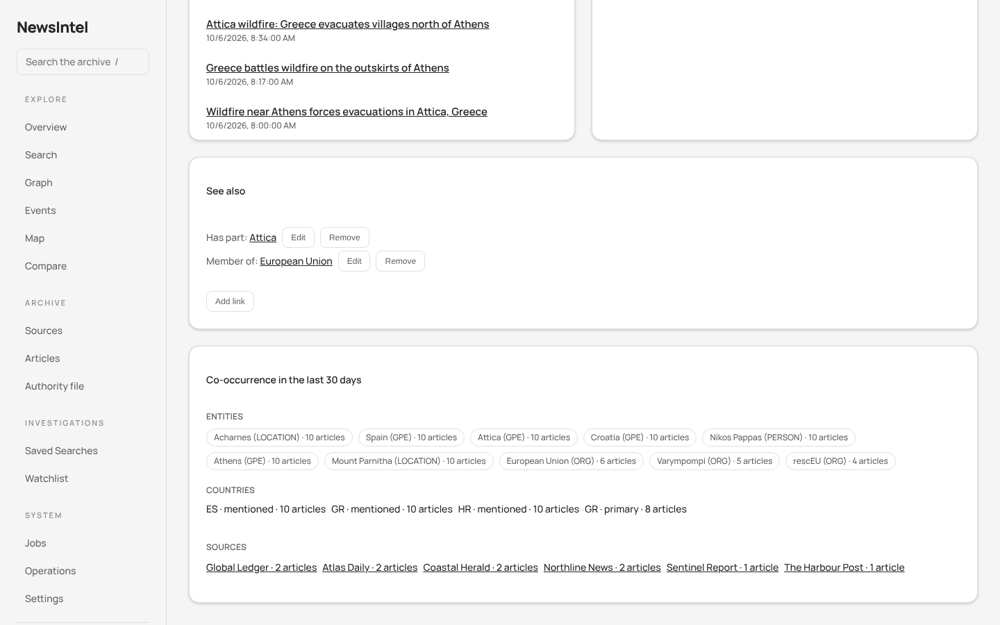
<sub>**Figure 10.** See-also links on a dossier: earlier and later names (an organisation that renamed itself), parts, members and leaders, or a plain "related" link, which needs a note saying how. Each link can carry dates, a note and the article it came from, and shows from both sides.</sub>

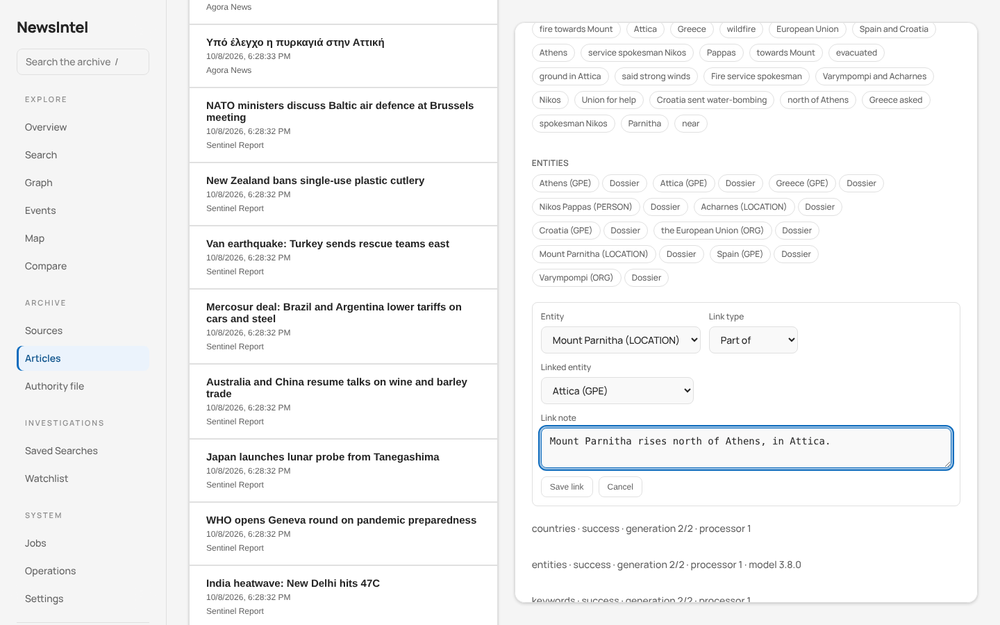
<sub>**Figure 11.** Linking two entities while reading: the article's own entities fill the form, and the link records the article as its source.</sub>

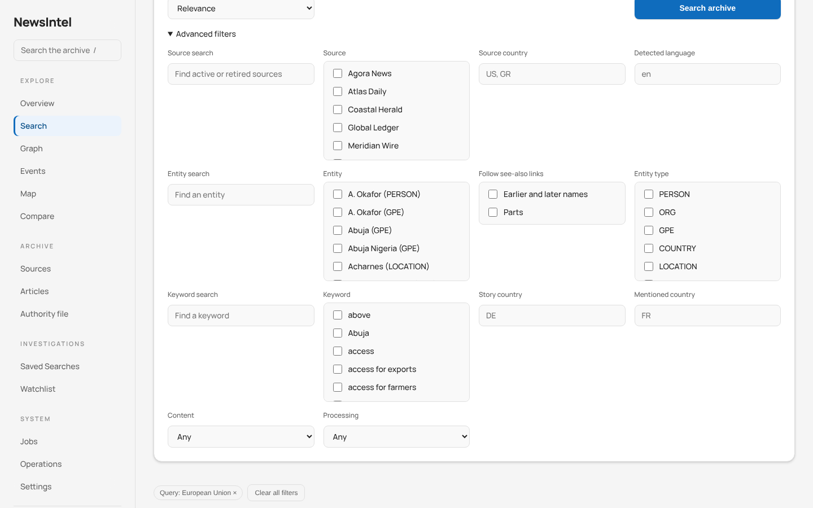
<sub>**Figure 12.** Searches and monitors can follow see-also links: filtering by an entity can also take in its earlier and later names, or its parts, so a search for a country can include its regions, and their towns in turn.</sub>

Searching, the graph, the dossiers, monitors and saved searches all work on roots: a filter on a variant finds its root's articles, and ids saved before a merge keep working. Merging and splitting move each article's mentions in batches (Figure 2), so a large merge never blocks a request. `python -m app.cli authority export` writes the whole file as JSON, by name rather than by id, and `authority import` applies it to another database or to the same one after a rebuild, before NLP runs again; `authority seed-countries` ties the usual spellings of each country ("USA", "U.K.") to its entity. A country renamed with the same territory (Swaziland, now Eswatini) is one entity: merge the old name into the new one rather than linking them.

The remaining routes follow the same design language:
- **Sources**: per-feed dossiers with health, fetch history and coverage, and where the source sits in story timing (first to publish in N of M shared stories, or the median minutes behind the first article).
- **Compare**: two entities, two sources or two countries side by side, with the articles and stories only one has and those both share.
- **Clusters** and **Articles**.
- **Processes**: every background process on one page (it replaces Jobs and Operations): service health, a card per process, one activity list with Retry and Stop, feed health and storage.
- **Settings**.

## 5. Tech stack

| Layer | Technology |
| --- | --- |
| Backend | Python, FastAPI, SQLAlchemy 2, Alembic, Pydantic, `uv` |
| Background jobs | Dramatiq, Redis, PostgreSQL job tables with leases |
| Canonical storage | PostgreSQL |
| Search | Elasticsearch (versioned indices behind an alias, zero-downtime reindexing): full text, facets, investigation analytics and map, related coverage |
| NLP | spaCy NER for English and Greek (optional image, off by default; enable with `docker/compose.ner.yaml`, then switch Greek on in Settings), YAKE keywords, Lingua language detection, pluggable/versioned processors |
| Extraction | Trafilatura, behind a replaceable extractor interface |
| Frontend | Next.js (App Router, static export), React, TypeScript, TanStack Query, Apache ECharts |
| Deployment | Docker Compose |

## 6. Operations

**First run.** See [Quickstart](#quickstart). Migrations run on every `up` through the one-shot `setup` service, which the application services wait for. Elasticsearch starts empty; run `docker compose --env-file .env -f docker/compose.yaml run --rm api python -m app.cli rebuild-search` once before Search or the Overview analytics panels have anything to show. It prints `status=completed` once the alias points at the new index; if articles changed during the scan it prints `status=catching_up`, so run `python -m app.cli resume-search-rebuild <rebuild_id>` until it completes (`search-index-status` lists rebuilds).

**What needs Elasticsearch.** Search, facets, the Overview analytics panels, the Graph, the Watchlist's results, "What changed" and evaluation, the investigation Map and Related coverage read the index. While it is down they return an error or say they are unavailable, and ingestion, processing and the recent-window Map keep working. A view that needs a newer index than the current one asks for an upgrade; run `rebuild-search` (then `resume-search-rebuild <rebuild_id>` if it reports `catching_up`), which builds the new index beside the live one and moves the alias once it has caught up. The previous index is kept for rollback.

**Estimated counts.** Three numbers come from Elasticsearch's cardinality estimate (precision 3000). Two are labelled: the distinct stories behind a Graph edge ("about N stories (estimated)"), and the story and source counts of the investigation Map (`≈N` in the table, "estimated" to a screen reader). The Watchlist's "N new stories" badge is not marked; it is a notification count and near-exact below 3000 distinct stories. Every other count is exact for the indexed snapshot.

The Processes page (`/processes/`; the old `/jobs/` and `/operations/` addresses lead there) shows what the archive does in the background, refreshed every 5 seconds while the tab is open:

- **Services**: PostgreSQL, Redis, Elasticsearch, the NLP models, the scheduler heartbeat and a live worker on every queue.
- **A card per process**, in three groups. *Per item*: feed fetching, article download, NLP, story clustering, search indexing, watchlist monitors. *Bulk runs*: NLP reprocessing, name changes, search index rebuild, source reindex. *Scheduled*: event linking, history cleanup, Wikidata refresh and suggestions. A card turns red only for failures inside the chosen window (1 h, 24 h or 7 d).
- **Activity**: one list across all of them, by default what needs attention (running, retrying, failed in the window). Click a card to see only that process.
- **Actions**: *Retry* on a failed row, *Retry N failed* on a card (200 at a time), *Run now* on the scheduled processes, and *Stop* on NLP reprocessing and Wikidata runs. Name changes, source reindexing and the index rebuild cannot be stopped: half a merge or reindex would leave the index inconsistent. The rebuild stays a CLI command.
- **Feeds** (with *Fetch now*), **Storage** and **Wikidata**.

Two things it does not show:

- **Article file size.** Retained article HTML lives on the worker's `article-data` volume, which only the worker mounts. Measure it from the host: `docker compose --env-file .env -f docker/compose.yaml exec worker du -sh /var/lib/newsintel/articles`.
- **History retention.** Every hour (or on *Run now* in the History cleanup card), the scheduler deletes succeeded job rows older than 30 days that a newer row replaces, and sessions that expired or were revoked more than 30 days ago. Failed rows are kept for diagnosis.

### Backup and restore

PostgreSQL holds everything that matters (P1). Elasticsearch is rebuilt from it, so it needs no backup. Retained article HTML, on the worker's `article-data` volume, is optional. The full Docker test gate rehearses the dump and restore (`infra/test-restore.sh`).

Back up:

```sh
alias dc='docker compose --env-file .env -f docker/compose.yaml'
dc exec -T postgres pg_dump -U newsintel -Fc newsintel > newsintel-$(date +%F).dump
dc run --rm --no-deps -T worker tar czf - -C /var/lib/newsintel articles > articles-$(date +%F).tgz  # optional
```

Restore:

```sh
dc stop api worker nlp-worker scheduler
dc exec -T postgres pg_restore -U newsintel -d newsintel --clean --if-exists --no-owner --exit-on-error < newsintel-DATE.dump
dc run --rm --no-deps -T worker tar xzf - -C /var/lib/newsintel < articles-DATE.tgz  # if backed up
dc run --rm api alembic upgrade head    # a dump from an older release needs the newer migrations
dc up -d
dc run --rm api python -m app.cli rebuild-search   # the index no longer matches the restored rows; resume-search-rebuild <id> if catching_up
```

The dump carries the authority file with everything else. To keep your naming decisions across a fresh database instead, export them first and apply them to the new database before the feeds are ingested again:

```sh
dc run --rm -T api python -m app.cli authority export > authority.json
# … the new database is up …
dc run --rm -v "$PWD/authority.json:/authority.json:ro" api python -m app.cli authority import --file /authority.json          # dry run
dc run --rm -v "$PWD/authority.json:/authority.json:ro" api python -m app.cli authority import --file /authority.json --apply
```

## 7. Development checks

The system is typed and tested end to end, and everything runs in containers: development and validation need only Docker with Compose, Git and ordinary POSIX shell utilities. The backend is checked with `ruff` and strict `mypy`; the frontend is TypeScript, using API types generated from the checked-in OpenAPI spec.

- `./infra/test-quick.sh` is the fast loop: unit tests, linting, type checks and the OpenAPI/TypeScript contract, with no service containers.
- `./infra/test-docker.sh` is the full gate: it builds dedicated test images, runs backend and frontend checks, rejects skipped tests and stale generated contracts, rehearses backup/restore, and runs every browser workflow against disposable Compose stacks.

GitHub Actions runs the quick loop, the frontend build and a workflow lint on every pull request and every push to `main` (`.github/workflows/ci.yml`). It runs the full gate after every merge to `main`, nightly, on demand, and on pull requests that change `infra/`, `docker/`, the Dockerfiles, `.github/actions/` or the workflow itself (`.github/workflows/full-gate.yml`). A change to nothing but the Markdown docs, the images in `assets/` or the licence starts neither. A green pull request therefore usually covers the quick loop only, so run the full gate before merging a change to application behaviour.

[CONTRIBUTING.md](CONTRIBUTING.md) covers running the stack locally, the integration and browser loops, regenerating the OpenAPI spec and TypeScript types, writing migrations, and the test harness's options and reports.

## 8. Limitations

In the tradition of papers that are honest about their methods:

- **No summarisation or "insight" generation.** NewsIntel groups, counts and links; it does not paraphrase. This is a choice: every output can be traced to its articles (P2), which a generated summary cannot promise.
- **Entity quality is spaCy's quality.** NER mislabels things: the small models used here call a city a person now and then, and tag one name with two types. Dates, times, amounts and time phrases it tags as names are filtered out, but other mislabels get through. The authority file (Figure 8) joins spellings of one entity, but only of the same type (a place may be a GPE or a LOCATION), so it cannot fix a wrong type, and its suggestions only look within one language. Annotations are versioned, so a better model can be rerun over the archive without losing the old results.
- **Story country is conservative.** It is only assigned when a country is named alone in the title and repeated in the text, and mainly for English-language articles, so most articles have none. The map says so rather than guessing.
- **Rule-based clustering and events.** They are deterministic and explainable. Story clustering also matches articles whose opening words share rare specifics (stemmed, and weighted by how rare each term is in the 48-hour window), so a reworded headline no longer hides a story. A true paraphrase in different vocabulary is still missed, and event association still relies on entities and headline terms. Articles clustered before the wording rule have no terms until they are reclustered (`python -m app.cli recluster --from-date … --to-date …`).
- **Related coverage is wording, not meaning.** It needs at least five shared terms, so a paraphrase in different words is missed, and a short or text-poor article gets no related coverage rather than a guess.
- **Scale is designed, not unlimited.** The target is on the order of five million articles on a single Compose host. Beyond that, the ceilings are named in the code as they are met.

## License

[MIT](LICENSE)
